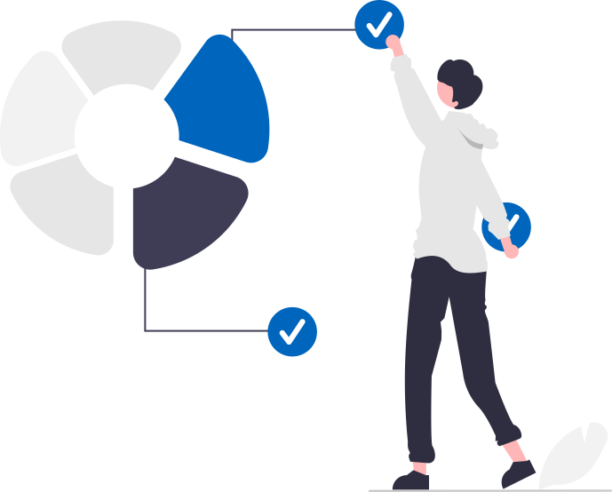

<h1 align="left">
  💻 s0ftportfolio
</h1>

<h3>🚀 Projeto:</h3>

  
• 📚 Este projeto é o meu <b>Software Portfolio</b>, onde compartilho habilidades, projetos e minha trajetória profissional no universo da tecnologia da informação, com foco em soluções inovadoras e eficientes para diferentes necessidades de mercado.

  
• ⚙️ O portfólio inclui projetos pessoais e colaborativos, que demonstram minha capacidade de construir soluções escaláveis, de alta qualidade e adaptadas às demandas dinâmicas do setor de tecnologia.

  
• 🛠️ As ferramentas utilizadas neste projeto incluem tecnologias de ponta e práticas ágeis, visando a criação de soluções robustas e o aprimoramento contínuo da experiência do usuário.

  
  
  
  
  
  
  
  

<h3>📚 Sessões:</h3>
<ul>
  <li>Sobre Mim</li>
  <li>Código Aberto (Github)</li>
  <li>Experiência</li>
  <li>Blogs</li>
  <li>Educação</li>
  <li>Contatos</li>
</ul>

<b><a href="https://gabr1elazevedo.github.io/" target="_blank">Exemplo Online</a></b>

<h3>📋 Clonagem:</h3>

<h4>Pré-requisitos de desenvolvimento.</h4>

Este projeto utiliza a biblioteca <code>React.JS</code> do <code>JavaScript</code>. Para desenvolvê-lo, é necessário ter o <code>Node.JS</code> e o <code>NPM</code> instalados em sua máquina.

<h4>Instalação das dependências.</h4>

Acesse o site oficial do <code>Node.JS</code> <a href="https://nodejs.org/en" target="_blank">Download</a> e baixe a versão mais recente estável ou uma versão compatível com os badges indicados no repositório.

Durante a instalação do <code>Node.JS</code>, o <code>NPM</code> (Node Package Manager) será automaticamente instalado.

<h4>Configurando o ambiente de desenvolvimento.</h4>
<ul>
  <li><b>Clone do repositório:</b> Após a instalação bem-sucedida do <code>Node.JS</code> e <code>NPM</code>, abra o terminal e execute o seguinte comando para clonar o repositório para o seu sistema local:
    <pre><code>git clone https://github.com/gabr1elazevedo/s0ftportfolio.git</code></pre>
    (Este comando irá baixar todos os arquivos do projeto para a sua máquina.)
  </li>

  <li><b>Instalação de dependências:</b> Navegue até o diretório onde o repositório clonado foi armazenado e execute o seguinte comando para instalar as dependências necessárias:
    <pre><code>npm install</code></pre>
    (Este comando irá baixar e instalar todas as bibliotecas externas utilizadas pelo projeto.)
  </li>

  <li><b>Executando o projeto:</b> Com as dependências instaladas, você já pode iniciar o projeto localmente. Execute o seguinte comando no terminal:
    <pre><code>npm start</code></pre>
    (Este comando irá iniciar o servidor de desenvolvimento e abrir o website em seu navegador.)
  </li>
</ul>

<h3>✏️ Customização:</h3>

<h4>Personalizando seu Portfólio Online!</h4>

Este guia permite que você personalize seu portfólio online, tornando-o uma representação única e impactante de suas habilidades e experiências. Aqui estão as principais áreas que você pode modificar:

<ul>
  <li><b>Arquivo package.json</b>: Localize este arquivo no diretório principal do seu projeto. Altere a propriedade <code>"name"</code> para refletir o identificador preferido do seu site. Atualize a propriedade <code>"homepage"</code> para <code>https://<seu-username-github>.github.io</code>.</li>
  <li><b>Informações Pessoais:</b> Abra o diretório <code>src/portfolio.js</code>. Este arquivo contém dados sobre você. Modifique as seções <code>greeting</code>, <code>socialMediaLinks</code>, <code>Experiência, Educação, Habilidades, Certificações</code>, etc.</li>
  <li><b>Ícones na Página Inicial:</b> A seção de habilidades obtém dados do array <code>skills</code> dentro de <code>portfolio.js</code>. Você pode adicionar ícones personalizados de sites como [Iconify](https://icon-sets.iconify.design/).</li>
  <li><b>Informações do GitHub:</b> Configure variáveis de ambiente para acessar os dados do GitHub, como pull requests e issues, no arquivo <code>fetcher.mjs</code>.</li>
  <li><b>Logo de Abertura:</b> O logotipo animado usa o <code>Figma</code> para design e <code>CSS3</code> para animação.</li>
</ul>

<h3>🎨 Temas:</h3>

Você pode alterar os temas do Portfólio no arquivo <code>src/theme.js</code>, onde todos os temas disponíveis são mencionados com seus respectivos códigos de cores. Para alterar o tema, altere o código abaixo:

<pre><code>export const chosenTheme = blueTheme;</code></pre>

Altere o nome do tema e o código cuidará de todo o resto. Execute <code>npm start</code> para verificar se está tudo certo!

<h3>📦 Hospedagem:</h3>
<h4>Deixando seu Portfólio online!</h4>

Agora que você concluiu todas as etapas anteriores com sucesso, é hora de colocar seu site online! Eu altamente recomendo usar o <code>GitHub Pages</code> para fazer isso da maneira mais fácil.

<h4>Alternativa 1</h4>
<ol>
  <li>Execute <code>npm run build</code> para gerar a pasta de compilação de produção.</li>
  <li>Entre na pasta de compilação, execute <code>git init</code> e envie o código gerado para a <code>branch master</code> do seu novo repositório no GitHub.</li>
</ol>

<h4>Alternativa 2</h4>
<ol>
  <li>Execute <code>npm run deploy</code> para compilar e criar uma <code>branch</code> chamada <code>gh-pages</code>.</li>
  <li>Habilite o <code>GitHub Pages</code> nas configurações do repositório e selecione a <code>branch gh-pages</code>.</li>
  <li>Agora, seu site está implantado com sucesso e você pode visitá-lo em: <code><seu-username-github>.github.io</code>.</li>
</ol>

<h3>📄 Licença:</h3>

Veja <a href="./LICENSE" target="_blank">LICENSE.md</a> para mais detalhes.

<h3>✨ Contribuições:</h3>
<!-- ALL-CONTRIBUTORS-LIST:START -->
<table>
  <tbody>
    <tr>
      <td align="center" valign="top" width="14.28%"><a href="http://gabr1elazevedo.github.io"> <b>Gabriel Azevedo</b></a> <a href="https://github.com/gabr1elazevedo/s0ftportfolio/commits?author=gabr1elazevedo" title="Code">💻</a> <a href="https://github.com/gabr1elazevedo/s0ftportfolio/commits?author=gabr1elazevedo" title="Documentation">📖</a> <a href="#design-gabr1elazevedo" title="Design">🎨</a> <a href="#maintenance-gabr1elazevedo" title="Maintenance">🚧</a> <a href="#ideas-gabr1elazevedo" title="Ideas, Planning, & Feedback">🤔</a></td>
    </tr>
  </tbody>
</table>
<!-- ALL-CONTRIBUTORS-LIST:END -->

<h3>👏🏻 Referências:</h3>
<ul>
  <li><a href="https://github.com/saadpasta/developerFolio" target="_blank">Saad Pasta's</a></li>
  <li><a href="https://github.com/ashutosh1919/masterPortfolio" target="_blank">Ashutosh1919's</a></li>
</ul>
